# Proyecto de Damas 8x8 con Agente de Inteligencia Artificial (Búsqueda Minimax Alfa-Beta)

Este proyecto corresponde a la implementación del **Juego de Damas Clásico (Draughts / Checkers)** en tablero estándar de $8 \times 8$, desarrollado para la asignatura de Inteligencia Artificial (Prof. Franz Polanco). Cuenta con un **Agente Basado en Objetivos** implementado mediante el algoritmo de búsqueda adversarial **Minimax con Poda Alfa-Beta ($\alpha$-$\beta$)** y una **función de evaluación heurística** multicriterio.

---

## Arquitectura General del Sistema

Se implementa una arquitectura **Cliente-Servidor REST Desacoplada**:
- **Backend**: Node.js + Express (gestión de reglas de damas, capturas obligatorias y cálculo de jugadas del agente de búsqueda).
- **Frontend**: HTML5, CSS3 Moderno (CSS Grid) y JavaScript ES6+ modular (interfaz gráfica intuitiva, animaciones, visualización de estados y control de turnos).

```text
proyecto_ia/
├── backend/
│   ├── README.md               # Guía general de configuración del servidor
│   ├── package.json            # Dependencias y scripts de Node.js
│   └── src/
│       ├── README.md           # Arquitectura del código fuente backend
│       ├── server.js           # Punto de entrada Express
│       ├── game/
│       │   ├── README.md       # Lógica pura del juego y reglas 8x8
│       │   ├── constants.js    # Constantes de jugadores, casillas y direcciones
│       │   ├── board.js        # Matriz 8x8, clonación y utilidades
│       │   ├── moveGenerator.js# Generación de jugadas y captura obligatoria
│       │   └── rules.js        # Aplicación de jugadas, coronación y fin de partida
│       ├── ai/
│       │   ├── README.md       # Cerebro del agente de búsqueda
│       │   ├── heuristics.js   # Función de evaluación heurística
│       │   ├── alphaBeta.js    # Algoritmo Minimax con poda Alfa-Beta
│       │   └── difficulty.js   # Niveles de dificultad (Fácil, Medio, Difícil)
│       └── routes/
│           ├── README.md       # Endpoints REST y controladores
│           ├── gameController.js
│           └── gameRoutes.js
├── frontend/
│   ├── README.md               # Guía de la interfaz web
│   ├── index.html              # Interfaz gráfica principal
│   ├── css/
│   │   ├── README.md           # Guía de estilos y efectos visuales
│   │   ├── style.css           # Layout general, paneles, botones y modal
│   │   └── board.css           # CSS Grid 8x8, fichas, coronas y animaciones
│   └── js/
│       ├── README.md           # Lógica interactiva del cliente
│       ├── api.js              # Consumo de la API REST con fetch
│       ├── boardUI.js          # Renderizado del tablero y animaciones
│       └── app.js              # Controlador principal y máquina de estados
├── .gitignore
└── README.md
```

---

## La Construcción del Edificio: Plan de Construcción Paso a Paso

Para garantizar una construcción modular, sólida y sin errores, el proyecto se construirá de manera estrictamente secuencial, **como un edificio que se levanta desde los cimientos hasta el último escalón**:

```mermaid
graph TD
    classDef cimientos fill:#2b2d42,stroke:#8d99ae,stroke-width:2px,color:#edf2f4;
    classDef estructura fill:#1d3557,stroke:#457b9d,stroke-width:2px,color:#f1faee;
    classDef maquinas fill:#386641,stroke:#6a994e,stroke-width:2px,color:#f2e8cf;
    classDef redes fill:#d62828,stroke:#f77f00,stroke-width:2px,color:#fcbf49;
    classDef fachada fill:#003049,stroke:#669bbc,stroke-width:2px,color:#fdf0d5;
    classDef elevador fill:#582f0e,stroke:#7f4f24,stroke-width:2px,color:#ede0d4;
    classDef penthouse fill:#6a0572,stroke:#ab83a1,stroke-width:2px,color:#ffffff;

    subgraph N0["🏛️ CIMIENTOS Y FUNDACIONES"]
        P1["Paso 1: Entorno Node.js & Dependencias (backend/package.json)"]:::cimientos
        P2["Paso 2: Constantes y Matriz del Tablero (backend/src/game/constants.js & board.js)"]:::cimientos
    end

    subgraph N1["🧱 PISO 1: COLUMNAS MAESTRAS (REGLAS DEL JUEGO)"]
        P3["Paso 3: Generador de Movimientos y Captura Obligatoria (moveGenerator.js)"]:::estructura
        P4["Paso 4: Aplicación de Movimientos, Coronación y Fin de Juego (rules.js)"]:::estructura
    end

    subgraph N2["🧠 PISO 2: SALA DE MÁQUINAS (MOTOR DE IA)"]
        P5["Paso 5: Función de Evaluación Heurística (backend/src/ai/heuristics.js)"]:::maquinas
        P6["Paso 6: Búsqueda Minimax con Poda Alfa-Beta (backend/src/ai/alphaBeta.js)"]:::maquinas
        P7["Paso 7: Calibración de Dificultades (backend/src/ai/difficulty.js)"]:::maquinas
    end

    subgraph N3["⚡ PISO 3: REDES Y CONEXIONES (API REST)"]
        P8["Paso 8: Controladores y Rutas de Juego (routes/gameController.js & gameRoutes.js)"]:::redes
        P9["Paso 9: Servidor Central Express y CORS (backend/src/server.js)"]:::redes
    end

    subgraph N4["🎨 PISO 4: FACHADA Y ESTRUCTURA VISUAL (FRONTEND)"]
        P10["Paso 10: Maquetación HTML Semántica y Modales (frontend/index.html)"]:::fachada
        P11["Paso 11: Tablero CSS Grid 8x8 y Piezas 3D (frontend/css/board.css)"]:::fachada
        P12["Paso 12: Paneles, Métricas, Botón Rendirse y Responsive (frontend/css/style.css)"]:::fachada
    end

    subgraph N5["🕹️ PISO 5: MECANISMOS E INTERACCIÓN (CLIENTE JS)"]
        P13["Paso 13: Cliente HTTP Fetch (frontend/js/api.js)"]:::elevador
        P14["Paso 14: Renderizador y Manipulador del DOM (frontend/js/boardUI.js)"]:::elevador
        P15["Paso 15: Orquestador de Partida y Control de Turnos (frontend/js/app.js)"]:::elevador
    end

    subgraph N6["🏆 PENTHOUSE: INSPECCIÓN FINAL Y SUSTENTACIÓN"]
        P16["Paso 16: Pruebas Integrales de Partida y Validación de Casos Límite"]:::penthouse
        P17["Paso 17: Guía y Métricas para la Evaluación Oral con el Catedrático"]:::penthouse
    end

    P1 --> P2 --> P3 --> P4 --> P5 --> P6 --> P7 --> P8 --> P9 --> P10 --> P11 --> P12 --> P13 --> P14 --> P15 --> P16 --> P17
```



---

### Detalle de los Pasos de Construcción

#### Cimientos (Fundaciones Base)
1. **Paso 1**: Inicializar el backend en `backend/` con `npm init -y` e instalar `express`, `cors`, `dotenv` y `nodemon`.
2. **Paso 2**: Implementar `backend/src/game/constants.js` (constantes del juego) y `backend/src/game/board.js` (matriz $8 \times 8$, conteo de fichas y clonación de estados).

#### Piso 1: Reglas del Juego (Game Rules)
3. **Paso 3**: Implementar `backend/src/game/moveGenerator.js` con el algoritmo de saltos simples y la regla de **captura obligatoria** (incluyendo saltos múltiples encadenados).
4. **Paso 4**: Implementar `backend/src/game/rules.js` (traslado de piezas, eliminación de fichas comidas, coronación al llegar al extremo y detección de victoria o bloqueo).

#### Piso 2: Inteligencia Artificial (AI Engine)
5. **Paso 5**: Implementar `backend/src/ai/heuristics.js` con la función de evaluación ponderada (material, control central, avance a coronación, defensa de última fila y movilidad).
6. **Paso 6**: Implementar `backend/src/ai/alphaBeta.js` con el algoritmo Minimax con poda Alfa-Beta y ordenamiento de movimientos para maximizar la poda.
7. **Paso 7**: Implementar `backend/src/ai/difficulty.js` (Fácil: profundidad 2; Medio: profundidad 4; Difícil: profundidad 6).

#### Piso 3: Capa de Red (API REST)
8. **Paso 8**: Implementar `backend/src/routes/gameController.js` y `gameRoutes.js` con los endpoints `/api/game/new`, `/api/game/valid-moves` y `/api/game/ai-move`.
9. **Paso 9**: Implementar `backend/src/server.js` conectando middlewares de Express, habilitando CORS y arrancando el servidor en el puerto 3000.

#### Piso 4: Fachada y Presentación (UI/UX)
10. **Paso 10**: Construir `frontend/index.html` con layout responsivo, encabezado, tablero, marcador de piezas, controles y modal de fin de partida.
11. **Paso 11**: Diseñar `frontend/css/board.css` con CSS Grid para el tablero $8 \times 8$, casillas claras/oscuras, fichas circulares con relieve, iconos de reyes y efectos de salto.
12. **Paso 12**: Diseñar `frontend/css/style.css` con tipografía, paleta de colores, estado de turno, botón "Rendirse", selectores de dificultad y diseño responsivo.

#### Piso 5: Interacción del Cliente (Client Controller)
13. **Paso 13**: Implementar `frontend/js/api.js` con funciones asíncronas para consultar los endpoints del backend mediante `fetch()`.
14. **Paso 14**: Implementar `frontend/js/boardUI.js` para renderizar casillas, fichas, resaltado de selecciones y casillas válidas.
15. **Paso 15**: Implementar `frontend/js/app.js` integrando el bucle de juego, gestión de turnos (Humano e IA), saltos encadenados del humano, botón de rendición y victoria.

#### Penthouse: Verificación y Entrega
16. **Paso 16**: Ejecutar pruebas completas de integración verificando captura obligatoria, coronación, opciones de rendirse y partidas fluidas contra la IA en todos los niveles.
17. **Paso 17**: Preparar la guía de preguntas de sustentación oral explicando la complejidad de Minimax ($O(b^d)$) vs. Poda Alfa-Beta ($O(b^{d/2})$) y el funcionamiento del árbol de estados.
