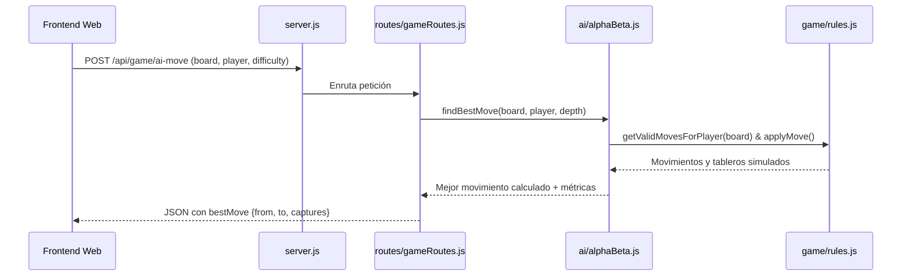

# Código Fuente del Servidor (`backend/src/`)

## 1. Propósito del Directorio
Este directorio contiene todo el código fuente del backend desarrollado sobre **Node.js**. Su diseño sigue una arquitectura modular en tres capas:
1. **`game/`**: Lógica de dominio y reglas del juego (Damas 8x8).
2. **`ai/`**: Inteligencia artificial (Agente de búsqueda Minimax con poda Alfa-Beta y heurística).
3. **`routes/`**: Controladores y endpoints de la API REST.

---

## 2. Archivo Principal: `server.js`

### Responsabilidad de `server.js`
- Es el **punto de entrada (*entry point*) de la aplicación Node.js**.
- Inicializa la instancia de Express.
- Configura middlewares esenciales:
  - `cors()` para habilitar peticiones cross-origin desde el cliente web.
  - `express.json()` para el procesamiento de cuerpos JSON.
  - `express.static()` para servir opcionalmente los archivos del frontend si se aloja en el mismo puerto.
- Monta las rutas bajo el prefijo `/api/game`.
- Inicia la escucha en el puerto configurado (por defecto `PORT = 3000`).

---

## 3. Flujo de Datos del Backend

---

## 4. Instrucciones para el Agente de IA para su Construcción
1. **Configuración de Variables de Entorno**: Permitir configurar `PORT` mediante `process.env.PORT || 3000`.
2. **Manejo Centralizado de Errores**: Implementar un middleware final para capturar errores no controlados y responder con JSON estructurado `{ error: "Descripción" }`.
3. **Modularidad Estricta**: No colocar lógica de damas ni algoritmos Minimax directamente en `server.js`; delegar 100% en sus respectivos módulos.
